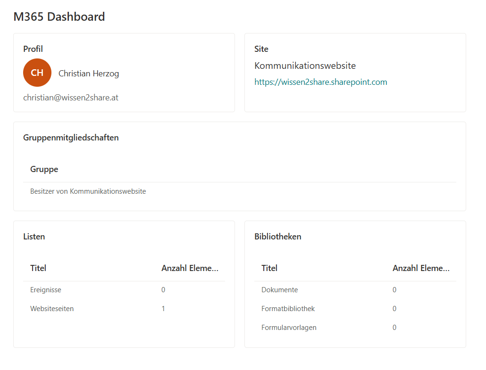

# M365 Dashboard – SPFx Web Part

SharePoint Framework (SPFx) Web Part, das zentrale Microsoft 365 Informationen
in einem Dashboard darstellt: Benutzerprofil, Site-Informationen,
Gruppenmitgliedschaften, Listen und Bibliotheken der aktuellen Site.

## Preview



## Tech Stack

- SharePoint Framework (SPFx) 1.23.2 (Heft-Toolchain)
- Node.js 22 LTS
- React 17 + Redux Toolkit + react-redux 8.x
- Fluent UI
- PnP-JS (`@pnp/sp`, `@pnp/graph`) für Microsoft Graph & SharePoint API

## Setup

```powershell
cd SPFX
npm install
npx heft trust-dev-cert
```

## Starten

```powershell
npm start
```

Für Zugriff auf echte Tenant-Daten (Graph/SharePoint) über Hosted Workbench:

```powershell
npx heft start --nobrowser
```

Dann öffnen: `https://<euer-tenant>.sharepoint.com/_layouts/15/workbench.aspx`

## Build

```powershell
npm run build
```

## Architektur

- React (Functional Components + Hooks)
- Zentraler Redux-Store mit unabhängigen State-Slices (`user`, `site`, `groups`, `lists`, `libraries`)
- Jede Komponente lädt ihre Daten selbständig und dispatcht sie in den Store – keine zentrale Bootstrap-Logik
- Zugriff auf Microsoft Graph und SharePoint ausschließlich über PnP-JS
